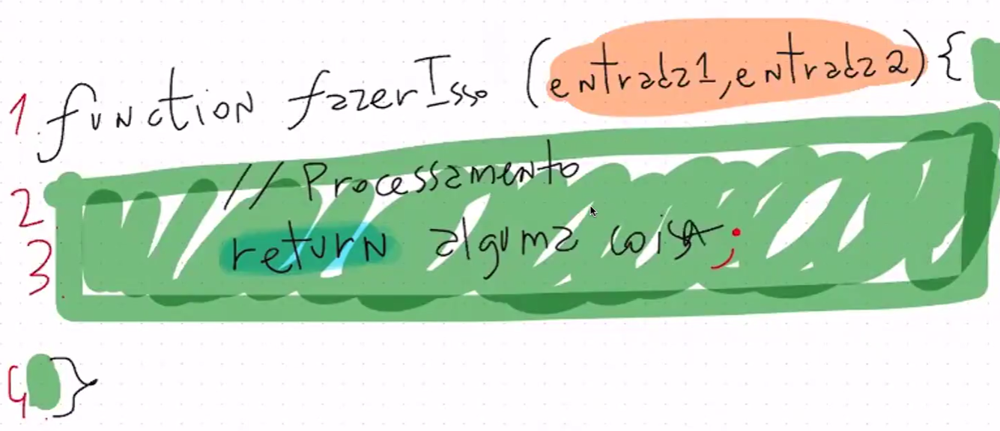
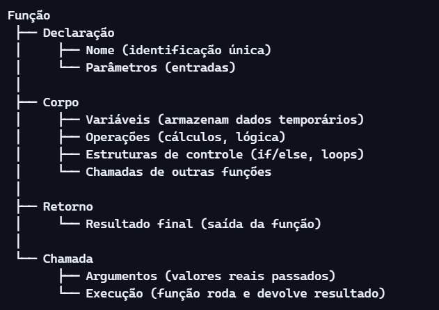

# AULA 02 - Programação, codificação e Javascript na prática

Arquitetura de uma função:

Uma função tem duas partes: Definição e chamada

**Exemplo:**

function calcularMedia(n1, n2, n3) {   // Declaração
    let soma = n1 + n2 + n3;           // Corpo
    let media = soma / 3;              // Corpo
    return media;                      // Retorno
}

let resultado = calcularMedia(8, 7, 9); // Chamada
console.log(resultado); // 8

