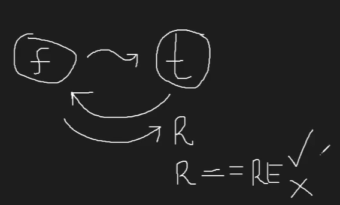

# Aula 05 de lógica de Programação em Javascript: Else if, Mocha e Primeiro teste automatizado

Desafio de Lógica de Programação:

Crie um programa que me ajude a saber quantas semanas de licença devo conceder aos meus funcionários quando seu filho nasce. O sistema precisa ser capaz de lidar com funcionários homens e mulheres.

**ENTRADA**
- Sexo

**PROCESSAMENTO**
- Se o funcionário for do sexo masculino tem direito a 2 semanas de licença paternidade
- Se o funcionário for do sexo Feminino tem direito a 12 semanas de licença maternidade

**SAÍDA**
- Quantidade de Semanas

# Criando testes automatizados

Biblioteca --> [@Mocha](https://mochajs.org/)

instalar o mocha: (executa o binário para instalação)

```bash
npm i -D mocha
```
para executar: (executa dentro do projeto)

```bash
npx mocha
```

Testes automatizados (os unitários) geralmente são feitos pelos devs.



O teste chama a função que devolve o resultado. Esse resultado é comparado para ver se é o esperrado. Isso seria uma asserção.

Para importar a biblioteca de asserção, usar: 

*import assert from 'node:assert'*

para criar uma suite de teste, usar a função 'describe' com uma fnção anônima:

*describe('Testes de Cálculos Trabalhistas', function () { })*

-> Para executar um teste ou grupo de testes específico, colocar it.only // describe.only
