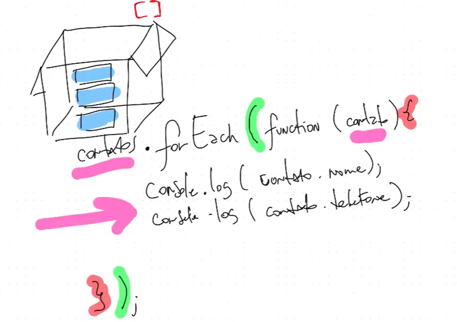

# Aula de lógica e programação em Javascript: Laço ForEach, Listas, Escopo e Testes com comparação de Objetos

EXERCÍCIO:

Preciso de um sistema de gestão de contatos. 
Inicialmente quero ser capaz de listar todos os contatos previamente cadastrados na agenda.
São eles: 
- Polícia 190
- Bombeiros 193
- SAMU 192

Modelo de saída: "Contato: Polícia / Telefone: 190"

ENTRADAS: (O usuário que informa)
- N/A

PROCESSAMENTO:
- Listar contatos já cadastrados mostrando nome e número
- Colocar o contato no formato conforme modelo

SAÍDAS:
- lista de contatos conforme modelo

# LAÇO DE REPETIÇÃO

Exemplo: Lista de contatos

A função forEach() passa por todos os ítens da lista obrigatoriamente

Armadura do forEach()

EXERCÍCIO:

Preciso de uma função capaz de adicionar um novo contato na lista. Ele deve receber nome e telefone.
Deposi de adicionar, deve retornar o último contato registrado

1. Entrada
- nome
- telefone

2. Processamento
- Adicionar o nome e telefone como um novo item da lista

3. Saída: 
- último item da lista